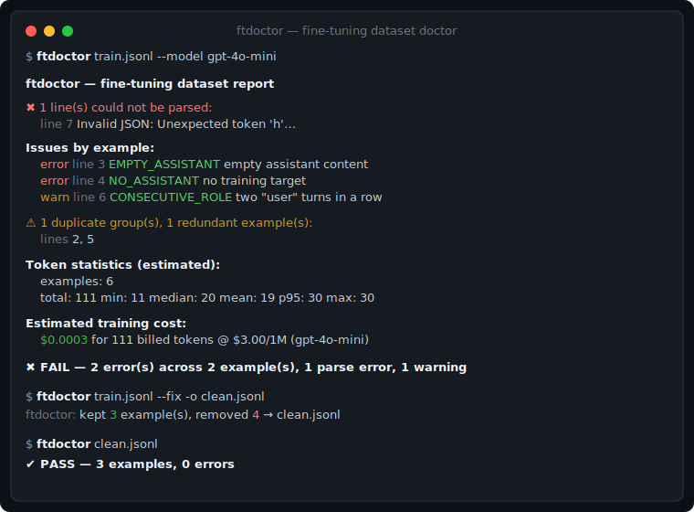

# ftdoctor

> Diagnose and auto-fix chat-format JSONL fine-tuning datasets — **zero dependencies, runs anywhere Node does.**

`ftdoctor` is a tiny command-line tool (and library) that catches the mistakes that make a fine-tuning job fail, waste money, or train on garbage — **before** you upload your dataset. It validates structure and role sequences, finds exact duplicates, estimates tokens and training cost, flags over-length examples, and can rewrite a clean copy of your file in one command.

It understands the chat `messages` format used by both **OpenAI** and **Anthropic** fine-tuning.



## Why

The common ways a fine-tuning run goes wrong are boring and avoidable:

- a single malformed JSON line rejects the whole upload,
- an example with no `assistant` message gives the model nothing to learn,
- empty assistant content trains the model to say nothing,
- duplicated examples quietly bias the model and inflate your bill,
- one giant example silently gets truncated past the context window.

`ftdoctor` finds all of these in one pass and tells you the exact line.

## Features

- ✅ **Structural validation** — valid JSON per line, `messages` array, `role`/`content` on every message.
- ✅ **Role-sequence checks** — unknown roles, missing assistant target, system-not-first, consecutive same-role turns.
- ✅ **Empty-content detection** — empty assistant replies are errors; other empty turns are warnings.
- ✅ **Exact duplicate detection** — order-independent fingerprinting, grouped by line number.
- ✅ **Token statistics** — per-example estimate plus total / min / median / mean / p95 / max.
- ✅ **Outlier flagging** — examples over a configurable token ceiling (default 16,384).
- ✅ **Training-cost estimate** — for common models, or pass your own `--price`.
- ✅ **One-command auto-fix** — drops invalid, empty, and duplicate examples into a clean `.jsonl`.
- ✅ **Zero dependencies**, ESM, works as a CLI **and** an importable library.

## Install

```bash
# run without installing
npx ftdoctor train.jsonl

# or install globally
npm install -g ftdoctor
```

Requires Node.js ≥ 18. No build step, no API keys, no network calls — everything runs locally.

## Usage

```bash
ftdoctor <dataset.jsonl> [options]
ftdoctor <dataset.jsonl> --fix -o clean.jsonl
cat data.jsonl | ftdoctor -          # read from stdin
```

### Options

| Option | Description |
| --- | --- |
| `--fix` | Write a cleaned dataset (drops invalid/empty/duplicate lines). |
| `-o, --out <file>` | Output path for `--fix` (default `<input>.clean.jsonl`). |
| `--drop-warnings` | With `--fix`, also drop examples that only have warnings. |
| `--max-tokens <n>` | Per-example token ceiling for outlier flagging (default `16384`). |
| `--model <name>` | Model for the cost estimate, e.g. `gpt-4o-mini`. |
| `--epochs <n>` | Training epochs for the cost estimate (default `1`). |
| `--price <usd>` | Override price per 1M training tokens. |
| `--json` | Print the full report as JSON instead of text. |
| `--no-color` | Disable ANSI colors. |
| `-h, --help` | Show help. |

Exit codes: **0** = clean, **1** = errors found, **2** = usage error — so it drops straight into CI.

### Example

```bash
$ ftdoctor train.jsonl --model gpt-4o-mini
```

```
✖ 1 line(s) could not be parsed:
  line 7  Invalid JSON: Unexpected token 'h'…

Issues by example:
  error line 3  EMPTY_ASSISTANT   Assistant message 1 has empty content
  error line 4  NO_ASSISTANT      Example has no assistant message
  warn  line 6  CONSECUTIVE_ROLE  Two consecutive "user" messages at index 1

⚠ 1 duplicate group(s), 1 redundant example(s):
  lines 2, 5

Token statistics (estimated):
  examples: 6
  total: 111   min: 11   median: 20   mean: 19   p95: 30   max: 30

Estimated training cost:
  $0.0003 for 111 billed tokens @ $3.00/1M (gpt-4o-mini)

✖ FAIL — 2 error(s) across 2 example(s), 1 parse error(s), 1 warning(s)
```

Clean it up in one shot:

```bash
$ ftdoctor train.jsonl --fix -o clean.jsonl
ftdoctor: kept 3 example(s), removed 4 → clean.jsonl
```

### In CI

```bash
ftdoctor train.jsonl || { echo "Dataset has errors — fix before training."; exit 1; }
```

## Library API

```js
import { lintDataset, fixDataset, formatReport } from 'ftdoctor';

const text = await fs.readFile('train.jsonl', 'utf8');

const report = lintDataset(text, { model: 'gpt-4o-mini', maxTokens: 8192 });
console.log(report.ok, report.errorCount, report.stats.total);
console.log(formatReport(report, { color: false }));

const { cleaned, kept, removed } = fixDataset(text);
await fs.writeFile('clean.jsonl', cleaned);
```

Also exported: `parseJsonl`, `validateExample`, `findDuplicates`, `exampleFingerprint`,
`estimateTokens`, `estimateExampleTokens`, `computeTokenStats`, `estimateTrainingCost`.

## How token estimation works

`ftdoctor` ships a small heuristic tokenizer (no native deps, no model downloads). It splits
text into word-runs and individual symbols and charges long words multiple tokens, mirroring how
BPE breaks rare words into sub-word pieces. It is typically within ~10–20% of `tiktoken` on English
prose — accurate enough for budgeting, outlier detection, and ballpark cost. Treat the numbers as
estimates, and pass `--price` for an exact provider rate.

## Validation rules

| Code | Severity | Meaning |
| --- | --- | --- |
| `NO_MESSAGES` | error | Missing `messages` array. |
| `EMPTY_MESSAGES` | error | `messages` array is empty. |
| `MSG_NOT_OBJECT` | error | A message is not an object. |
| `BAD_ROLE` | error | Role is not one of system/user/assistant/tool/function/developer. |
| `MISSING_CONTENT` | error | Message has no `content` field. |
| `EMPTY_ASSISTANT` | error | Assistant content is empty/whitespace. |
| `NO_ASSISTANT` | error | No assistant message (no training target). |
| `SYSTEM_NOT_FIRST` | error | System message appears after the first position. |
| `EMPTY_CONTENT` | warning | A non-assistant message has empty content. |
| `CONSECUTIVE_ROLE` | warning | Two consecutive user or assistant turns. |

## Development

```bash
npm test     # node --test, zero dependencies
```

## License

MIT © 2026 Ayubjon

## Support

If this project is useful to you, you can support its development with a crypto tip — thank you!

**USDT — Ethereum (ERC-20):**

`0xad39bdf2df0b8dd6991150fcea0a156150ed19b8`

[View / verify on Etherscan](https://etherscan.io/address/0xad39bdf2df0b8dd6991150fcea0a156150ed19b8)

> Send only on the **Ethereum (ERC-20)** network.
